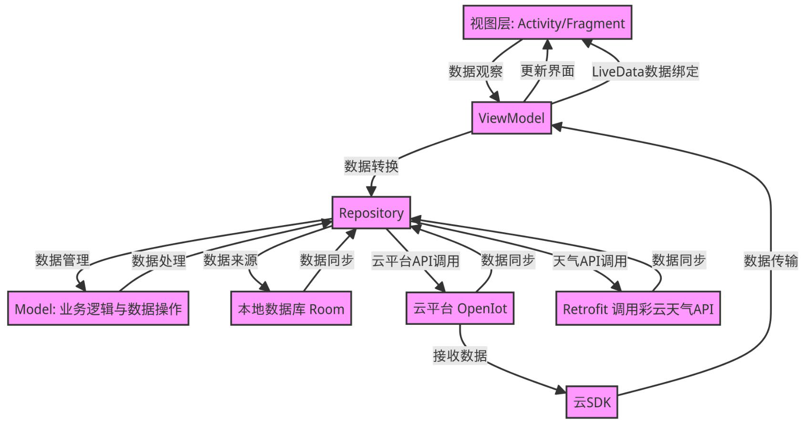
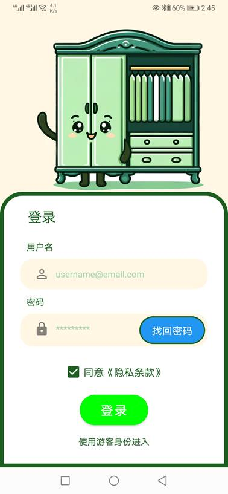
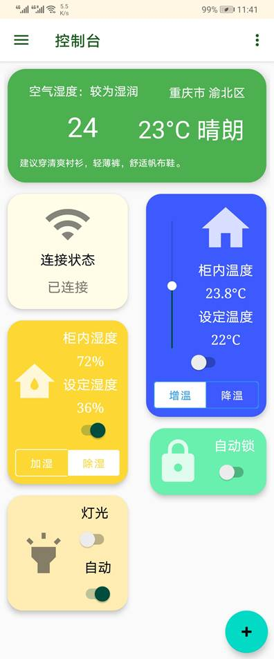

# 物联网智能衣柜设计-Android软件部分源代码

此项目将传统衣柜升级为具备环境监测、自主控制与云平台交互能力的智能设备。系统配合 Android
客户端，可实现远程控制、智能穿搭推荐、自动存取衣物等功能，是一个融合了物联网控制、嵌入式开发和 Android
应用设计的综合型项目。

此仓库实现了基于 Android 移动应用的智能衣柜控制系统的软件部分，将传统衣柜升级为集环境监测、远程控制、智能推荐与自动存取于一体的物联网设备。客户端采用
Kotlin + Jetpack Compose 开发，遵循 MVVM 架构，与 **Arduino MCU
端（见 [SmartWardrobeMCU](https://github.com/Ma-27/SmartWardrobeMCU)）协同工作**，通过 OneNet SDK
与云平台交互，并结合彩云天气 API 实现天气感知式的个性化穿搭推荐。

## 概述

本应用程序主要面向用户提供直观易用的衣柜管理和控制体验。通过内置的温湿度传感器（DHT11）、光敏电阻和舵机驱动的模拟衣架，系统可实时采集衣柜内部环境数据，并在用户设定阈值触发时自动调节温湿度和灯光。Android
客户端可以远程读取和下发控制命令，浏览当日环境数据，查看衣物评分并一键取放推荐衣物。为了实现个性化推荐，应用程序还会获取当日穿衣指数和历史穿着记录，运用加权非线性算法（Sigmoid
函数）对每件衣物进行评分，并按照得分排序展示，帮助用户快速选择最合适的搭配。

## 结构与功能

应用采用 MVVM（Model–View–ViewModel）架构设计，分为四层：

- **视图层（View）**：Activity/Fragment 通过 Jetpack Compose 或 XML 布局负责 UI 呈现及用户交互。
- **视图模型层（ViewModel）**：持有 LiveData，处理业务逻辑与数据变化，并将结果反馈给视图层。
- **数据仓库层（Repository）**：统一管理本地（Room 数据库）与远程（OneNet 云平台、彩云天气
  API）数据源，提供透明的增删改查接口。
- **模型层（Model）**：定义核心数据结构，如衣物实体、环境数据和用户偏好等。

网络通信分为两部分：

- **OneNet SDK**：设备端上传温湿度、光照等数据，并接收云平台下发的取衣、放衣或自动模式切换指令。SDK 内部封装了
  JSON 序列化、回调处理与超时重传机制，保障数据可靠传输。

- **Retrofit + Moshi**：与彩云天气 API 交互，获取当天气温、湿度和穿衣指数，以供推荐算法使用；请求结果通过
  Repository 层统一管理，并由 ViewModel 驱动界面更新。

应用的整体结构如图所示：

## 模块说明

#### 登录模块

首次启动应用时，用户将被引导至登录界面，通过设备 ID 和授权码完成衣柜与客户端的绑定。界面以卡片式设计为主，背景与主题色（绿色）呼应。

用户输入设备 ID
和授权码后，应用会先检查这些信息是否填写正确，并看看这台设备是否已经被绑定过。如果发现之前已经登录过了，系统会友好提示用户是否切换账号；如果是第一次绑定，系统则会联系云端平台，验证设备是否有效。这个过程通常很快。如果一切顺利，用户就会看到“绑定成功”的提示，随后进入主页面。

为了方便下次使用，应用还会自动保存绑定信息，下一次打开 App 时就可以跳过登录流程，直接进入系统。

从技术角度看，登录界面风格简洁，采用卡片式布局，用户输入后由 ViewModel 验证合法性，并通过 OneNet SDK
完成绑定流程。成功后持久化存储用户凭证，自动跳转至主页面。

#### 远程控制模块

在主页面的“控制台”标签页，用户可以直观查看衣柜的当前状态，比如里面的温度、湿度、亮度，还有灯光是否开启、衣架有没有正在运作等信息。这些内容都会以数字和图表的形式清晰地呈现在界面上。

用户可以根据自己的喜好选择使用“自动模式”或“手动模式”。在自动模式下，系统会根据预设的温湿度阈值自动调节衣柜内部环境；而在手动模式下，用户可以自由拖动滑条来调整温度或湿度设置，也可以通过开关按钮来控制灯光或衣架动作。

每当用户点击按钮或调整设置，应用就会把这些指令通过网络发送到衣柜。衣柜收到指令后会立即执行相应操作，然后把执行结果发回应用，界面也会随之更新。同时，系统会在日志中记录每次的操作，便于用户日后查看，也能帮助排查设备是否正常工作。整个过程对用户来说是流畅且无需技术背景的，哪怕第一次使用也能快速上手。

从技术角度看，用户的每次操作其实都经过 ViewModel 协调处理后，转发至 Repository，再由 OneNet SDK
封装为数据包发送至设备端，设备收到命令后执行相应动作并回传最新状态。

#### 衣物管理与推荐模块

衣物管理模块提供衣物的增删改查与可视化展示。应用启动时，Repository 会从 Room
数据库同步本地衣物记录，并定期从云端拉取最新同步状态。用户可通过“+”按钮添加新衣物：拍摄或选择照片后，在弹窗中为衣物填写名称、类别、材质等信息，并可自定义标签（如“正式”、“休闲”）。添加完成即刻展示于网格列表（GridView），每件衣物卡片上显示缩略图与基础信息。

在推荐页面（Recommend）中，系统会结合当日获取的彩云天气 API
数据（温度、湿度、穿衣指数）及本地历史穿着记录，以多因子算法为每件衣物生成综合评分：首先依据用户设定权重线性计算“穿衣指数匹配度”、“温度适配度”、“湿度适配度”和“历史穿着频次”四项原始得分；随后通过
Sigmoid 函数进行非线性映射，平滑突显中高得分差异；最后将评分映射到 0–5
分制并保留一位小数。推荐结果以卡片瀑布流形式展示，顶端自动悬浮当前环境概览与推荐理由概要（如“今天多云，当前温度适中，推荐轻薄单品”），帮助用户快速决策。

当用户点击某件衣物的“取衣”按钮或选择多件批量取衣时，同样的，ViewModel 会将操作封装为执行指令，发送至
Repository，由 OneNet SDK
推送到模拟衣架控制逻辑。衣架控制完成后，设备端在动作日志中标记执行结果，客户端在控制台日志与推荐页面同步显示“取衣成功”或“取衣失败”提示，并在衣物管理数据库中更新最后穿着时间，用于后续推荐计算。

#### 本地数据同步与持久化

为保证用户体验与离线可用性，应用在以下场景进行本地数据同步与持久化：

- 登录成功后，保存用户信息、设备绑定状态与配置信息。
- 每次远程控制完成后，将最新状态缓存，并将失败操作入队列，待网络恢复时自动重发。
- 衣物管理与推荐操作中，所有对 Room 数据库的增删改均通过 Repository 封装的 Data Access
  Object（DAO）透明执行。
- 启动时优先加载本地快照，再异步拉取云端最新数据并合并，防止卡顿与空白界面。

以上模块协同工作，构成了智能衣柜 Android 客户端的完整功能体系，实现了从用户交互、业务逻辑到底层网络通信与硬件控制的端到端闭环。

